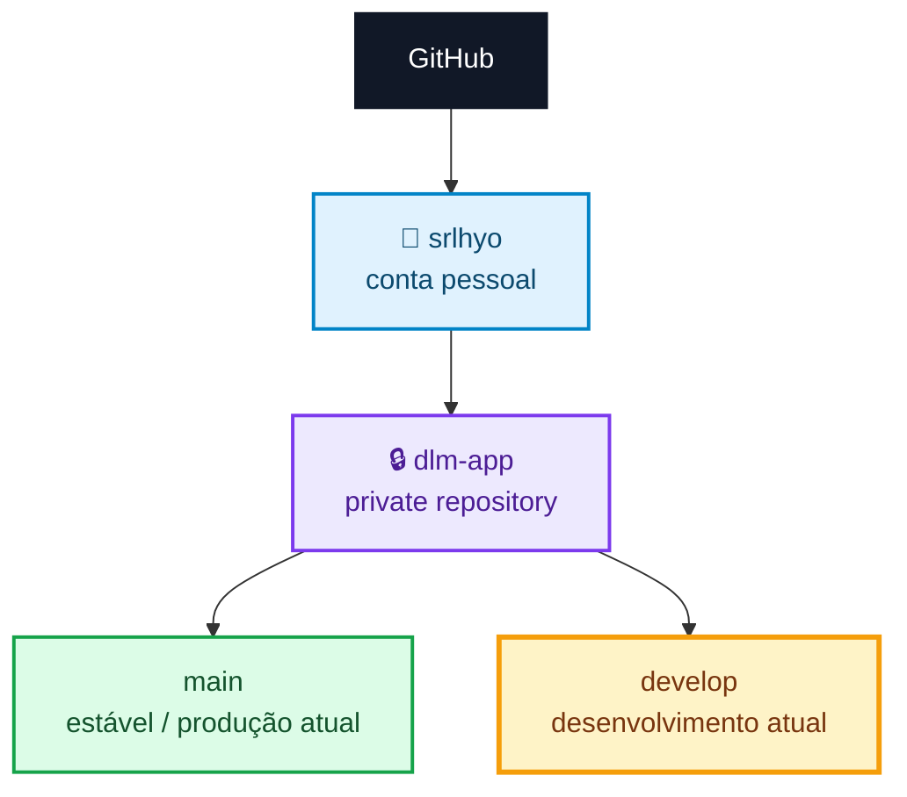
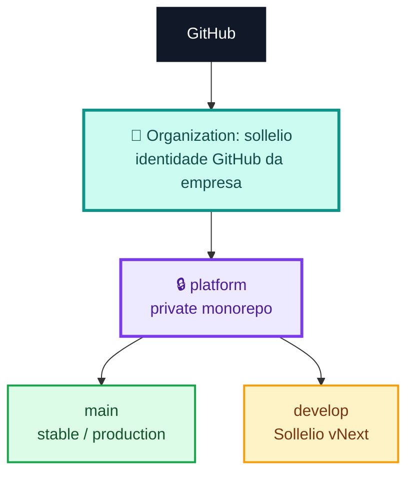
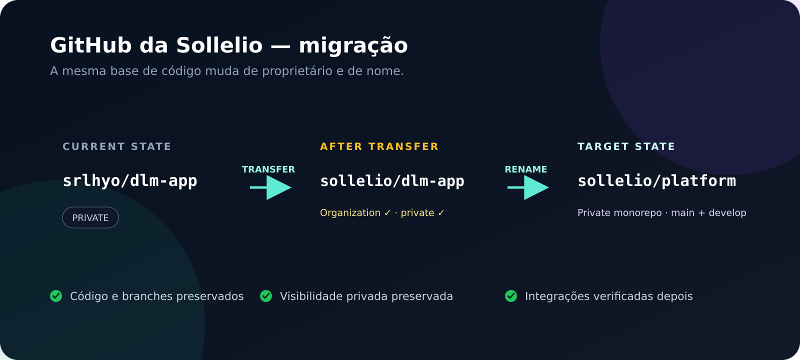
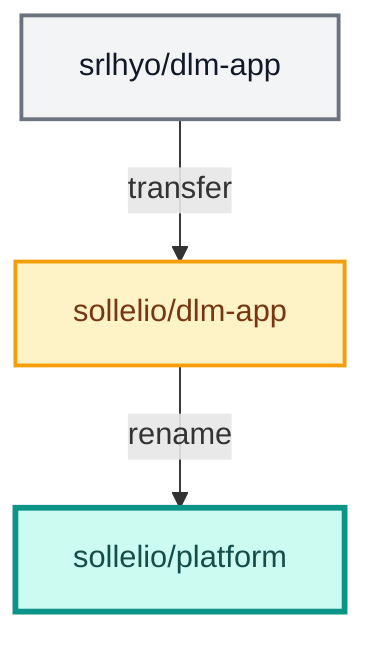
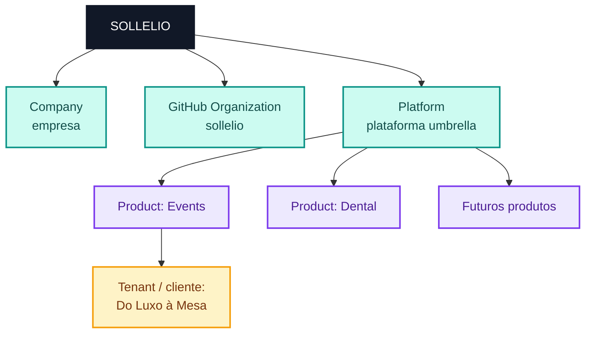
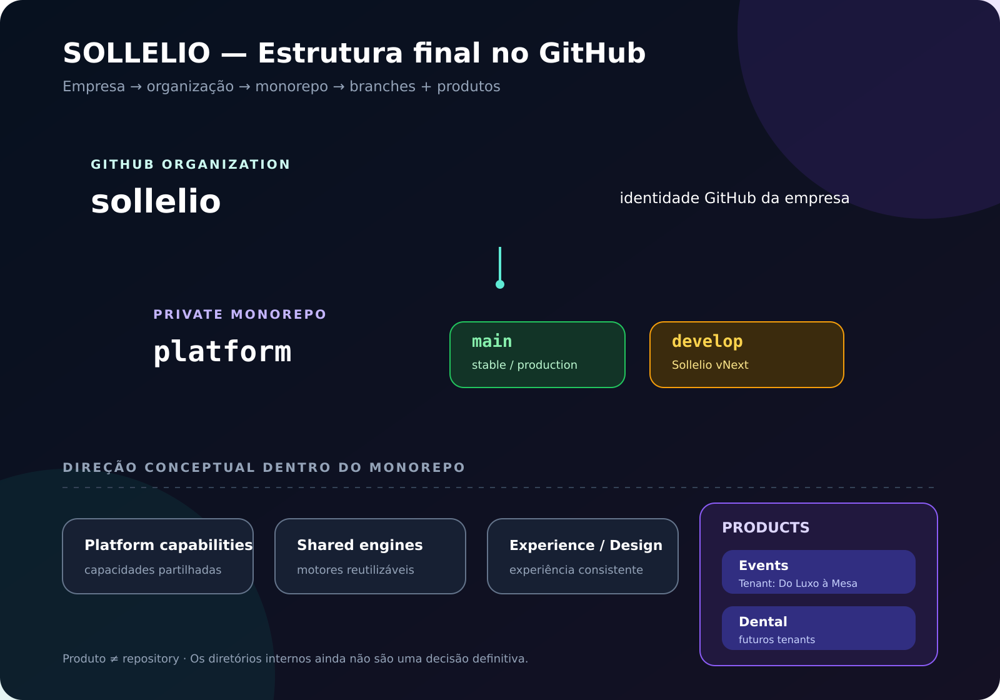
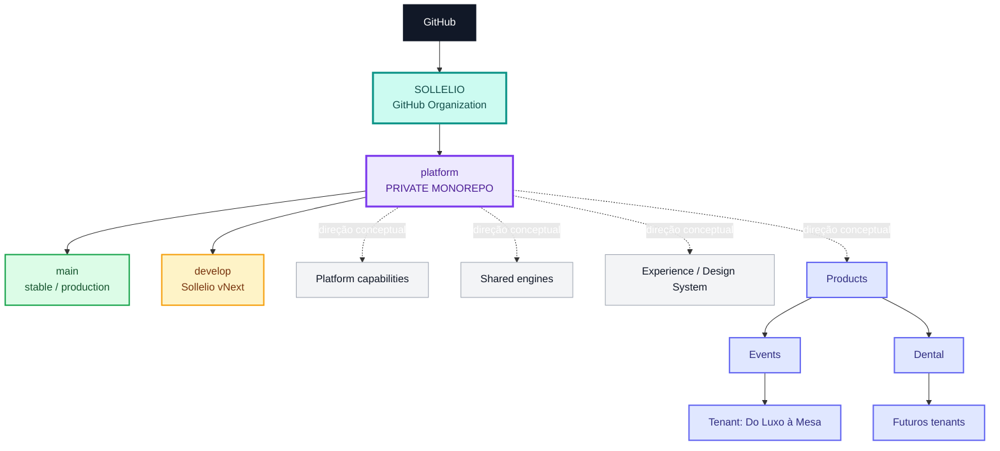

# GitHub — Estrutura da Sollelio

> [!NOTE]
> **Objetivo:** mover o repositório privado atual da conta pessoal para a organização da empresa, sem alterar o código nem separar produtos em vários repositórios.

```text
CURRENT STATE  ──────▶  MIGRATION  ──────▶  TARGET STATE
srlhyo/dlm-app          transfer + rename   sollelio/platform
```

---

## 1. Estado atual



- O repositório pertence atualmente à conta pessoal `srlhyo`.
- `dlm-app` continua privado e conserva as branches `main` e `develop`.
- O desenvolvimento ativo está em `develop`.
- O nome `dlm-app` ainda reflete a origem do projeto: Do Luxo à Mesa.

---

## 2. Estrutura final



| Elemento | Significado |
|---|---|
| `sollelio` | GitHub Organization da empresa |
| `platform` | Repositório principal e privado da plataforma |
| `main` | Branch associada à versão estável / produção atual |
| `develop` | Branch onde evolui a nova plataforma — **Sollelio vNext** |

> [!IMPORTANT]
> A migração reorganiza **propriedade e nome** no GitHub. Não deve alterar o conteúdo das branches nem a versão que está em produção.

---

## 3. Antes vs. depois

| Antes | Depois |
|---|---|
| `srlhyo/dlm-app` | `sollelio/platform` |
| Conta pessoal | Organização da empresa |
| Nome ligado ao primeiro cliente | Nome umbrella da plataforma |
| Repositório privado | Repositório privado |





---

## 4. O que representa cada nível



| Conceito | O que representa | Exemplo |
|---|---|---|
| **Sollelio** | Empresa e nome umbrella da plataforma | `Sollelio` |
| **Organization** | Espaço da empresa no GitHub | `github.com/sollelio` |
| **Repository** | Código principal da plataforma | `sollelio/platform` |
| **Product** | Capacidade comercial suportada pela plataforma | `Events`, futuramente `Dental` |
| **Tenant / cliente** | Negócio que usa um produto | `Do Luxo à Mesa` usa `Events` |

> [!TIP]
> **Sollelio não é um tenant.** Do Luxo à Mesa é um cliente/tenant. `Events` é um produto; `Dental` poderá ser outro.

---

## 5. Monorepo

### Decisão desta fase

```text
sollelio/platform     ← um único repositório privado
│
├── capacidades partilhadas da plataforma
├── engines partilhados
├── experience / design system
└── products
    ├── events
    └── dental
```

Os produtos começam como **módulos / bounded contexts dentro de `platform`**. Nesta fase, não serão criados repositórios separados para `events`, `dental`, `workflows` ou `design-system`.

> [!CAUTION]
> A árvore acima é uma **direção arquitetural conceptual**, não uma decisão definitiva sobre nomes de diretórios ou implementação.

| Agora | Não agora |
|---|---|
| `sollelio/platform` | `sollelio/events` |
| Produtos como módulos | `sollelio/dental` |
| Código partilhado no monorepo | `sollelio/workflows` |
| Uma evolução coordenada | `sollelio/design-system` |

---

## 6. Passos para executar

### A. Preparar

- [ ] Criar a GitHub Organization `sollelio`.
- [ ] Confirmar que a conta pessoal `srlhyo` é **Owner**.
- [ ] Ativar 2FA em `srlhyo` e, depois de verificar membros/colaboradores, configurar a política de 2FA da organização.
- [ ] Identificar e registar o commit/version atualmente em produção.
- [ ] Confirmar que o working tree local está num estado conhecido antes da migração.

### B. Transferir e renomear

- [ ] Transferir `srlhyo/dlm-app` para a organização `sollelio`.
- [ ] Confirmar que passa a existir `sollelio/dlm-app`.
- [ ] Renomear `dlm-app` para `platform`.
- [ ] Confirmar que o destino final é `sollelio/platform`.
- [ ] Confirmar que o repositório continua **private**.
- [ ] Confirmar que `main` e `develop` continuam intactas.

### C. Atualizar o repositório local

Ver o remote atual:

```bash
git remote -v
```

Atualizar o remote, se necessário:

```bash
git remote set-url origin git@github.com:sollelio/platform.git
```

Sincronizar e confirmar branches:

```bash
git fetch
git branch -a
git branch --show-current
```

- [ ] Confirmar que `origin` aponta para `git@github.com:sollelio/platform.git`.
- [ ] Confirmar que `main` e `develop` aparecem localmente/remotamente.
- [ ] Confirmar que a branch atual continua a ser `develop`.

### D. Validar integrações e produção

- [ ] Confirmar **ChatGPT ↔ GitHub**.
- [ ] Confirmar **Codex**.
- [ ] Confirmar **deploy / staging**.
- [ ] Confirmar **Netlify** ou outros serviços ligados ao repositório.
- [ ] Atualizar referências que ainda usem `srlhyo/dlm-app`.
- [ ] Voltar a confirmar o commit/version atualmente em produção.
- [ ] Confirmar que a reorganização do GitHub **não alterou o código de produção**.

> [!WARNING]
> Redirecionamentos do GitHub podem manter links antigos a funcionar, mas integrações, deploy keys, webhooks e configurações externas devem ser verificados explicitamente.

---

## 7. Resultado esperado





### Leitura rápida

```text
GitHub
└── SOLLELIO                         ← organização da empresa
    └── platform (private)           ← monorepo principal
        ├── main                     ← stable / production
        └── develop                  ← Sollelio vNext

platform — direção conceptual
├── Platform capabilities
├── Shared engines
├── Experience / Design System
└── Products
    ├── Events
    │   └── Tenant: Do Luxo à Mesa
    └── Dental
        └── futuros tenants
```

---

## 8. Regra para o futuro

> [!IMPORTANT]
> ## **Produto ≠ repository**
>
> Os produtos começam como módulos do monorepo `sollelio/platform`.

Um produto só deverá tornar-se um repositório separado quando existirem razões concretas, como:

- equipa independente;
- deployment independente;
- ciclo de release independente;
- ownership independente.

---

**Estado final de referência:** `sollelio/platform` · private · `main` + `develop` · monorepo.

<sub>Referências operacionais: [transferir um repositório](https://docs.github.com/en/repositories/creating-and-managing-repositories/transferring-a-repository) · [renomear um repositório](https://docs.github.com/en/repositories/creating-and-managing-repositories/renaming-a-repository) · [exigir 2FA na organização](https://docs.github.com/en/organizations/keeping-your-organization-secure/managing-two-factor-authentication-for-your-organization/requiring-two-factor-authentication-in-your-organization) · [atualizar o remote local](https://docs.github.com/en/get-started/git-basics/managing-remote-repositories)</sub>
